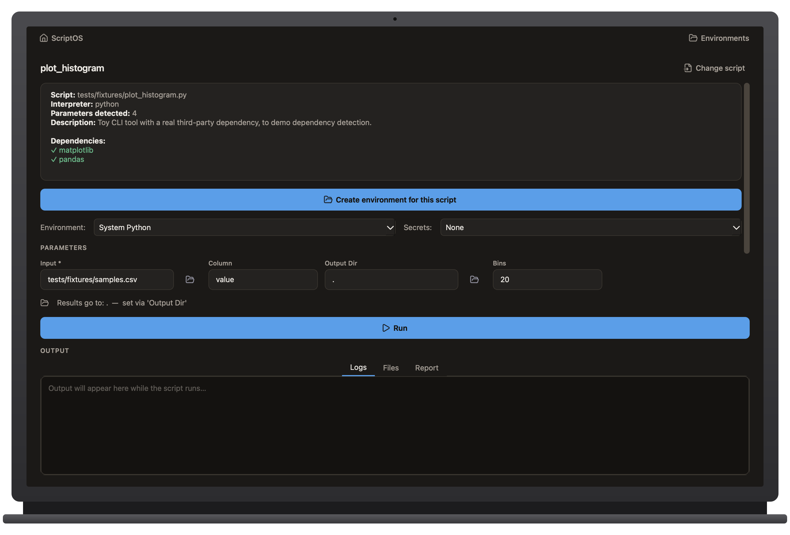

# ScriptOS

Turn a Python or R command-line script into a validated, reproducible desktop app — **no terminal required.**



**[📖 Full guide]([docs/index.md](https://lukasinscience.github.io/ScriptOS/))** — a complete walkthrough using the example scripts in `tests/fixtures/`.

## What it does

Drag a `.py` or `.R` script onto ScriptOS and it:

- Auto-generates a form from the script's `argparse`/`optparse` flags
- Detects dependencies and checks them against the interpreter/environment you pick
- Flags scripts that would hang (waiting on `input()`) or run risky code (`eval`, `os.system`, ...) before you click Run
- Shows the exact command it's about to run, live, as you fill in the form
- Streams live output, keeps a run history, and writes a reproducibility report (command, parameters, environment, duration) for every run
- Lets you cap memory/CPU so a runaway script gets killed automatically instead of eating your machine

Plus, for people who manage more than one script:

- **Environments** — isolated per-script Python installs (`~/.scriptos/envs/`), created and installed into with one click
- **Secrets Wallet** — encrypted local storage for API keys/passwords a script needs, injected as environment variables at run time, never shown in the command preview
- **Workflows** — chain scripts sequentially, each step's output auto-wired into the next step's input
- **CLI + Power Terminal** — a `scriptos` command line companion, plus a directory + environment picker that opens a terminal already `cd`'d and `source activate`'d

## Installing

Grab the latest build from **[Releases](../../releases/latest)** — no Python, no terminal:

- **macOS:** download `ScriptOS.dmg`, open it, drag ScriptOS into Applications
- **Windows:** download `ScriptOS-windows.zip`, unzip it, run `ScriptOS.exe`

Releases are built automatically by [`.github/workflows/release.yml`](.github/workflows/release.yml)
whenever a `v*` tag is pushed. To build a copy yourself instead, see
[`BUILD_WINDOWS.md`](BUILD_WINDOWS.md) (Windows) or run `./build.sh && ./make_dmg.sh` (macOS).

## Developing

```bash
python3 -m venv .venv
.venv/bin/pip install -e . PySide6 cryptography psutil pytest
.venv/bin/python -m app.main
.venv/bin/python -m pytest tests/ -q
```

## What ScriptOS is not

- Not a workflow engine — one script, one run (Workflows are a simple linear chain, not a DAG)
- Not a replacement for the command line for people who already use it
- Never installs anything without you clicking a button first
- Never touches your OS keychain — the secrets wallet is entirely local to `~/.scriptos`
- Not a security sandbox — the risk scan and resource limits are heads-ups and safety nets, not isolation

## License

[MIT](LICENSE)
